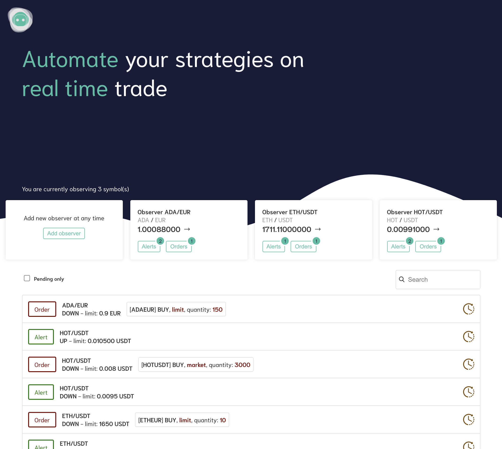

# Trados bot

This is a dockerized trading bot made for binance.

<p align="center"></p>

Features:

- Observe real time symbols price with a 1s threshold
- Get notified when they reach a certain limit
- Place market and limit orders regardless binance locked balances limitations
- Real time updates
- Authentication with JWT for deployment on VPS

Incoming features:

- Redesign Alerts creation form
- Add Let's Encrypt HTTPS encryption for deployment on VPS
- Handle config in database for dynamic testing.
- Add virtual balances for testing strategies and analyse performances
- And so on ... Feedback are necessary so leave a star to this repository, create an issue and support it!

## Requirements

Before eveything, ensure you have [docker](https://docs.docker.com/engine/install/), [docker-compose](https://docs.docker.com/compose/install/) and [git](https://git-scm.com/book/en/v2/Getting-Started-Installing-Git) installed.

## Getting started

Ensure you fit [requirements](#requirements) and then clone the repository by running

```bash
$ git clone https://github.com/give-some-hours/trading-bot.git && cd ./trading-bot
```

## Run the app

1. Copy `api/config/example.production.json` in `api/config/production.json` and fill it as below:

```bash
$ cp api/config/example.production.json api/config/production.json
```

- **db**: Change password or leave it like this.
- **security**: Static credentials to authenticate the application and some JWT parameters.
- **binance**: Fill with you `apiKey` and your `secretKey` that you'll find here: https://www.binance.com/en/my/settings/api-management
  `test` let you enable or not the test mode for order. (Note that this is not a dynamic value, it's computed on `make build`)
- **notifier**: Fill in with the configuration relating to your mailbox according to the nodemailer service configuration (support gmail and hotmail). For gmail, you'll need to follow this step: https://myaccount.google.com/lesssecureapps

2. Copy `example.nginx.conf.template` in `example.nginx.conf`

```bash
$ cp example.nginx.conf.tample nginx.conf.template
```

3. Build containers

```bash
$ make build
```

3. Create the database and demonstration records.

```bash
$ make db@create
```

<sup>If it fails, it's probably because the `db` container may take a while to get ready. Wait a bit and start over.
<strong>Note:</strong> This action is idempotent and will destroy your database if you have already performed it. Please run `make db@backup` first.
</sup>

4. Run it

```bash
$ make up
```

<sup>Then browse http://localhost</sup>

## Database monitoring

You can have a database overview throught pgadmin. It will reachable under a subdomain `db` of you configuration. If you run it locally, bind `db.localhost` in your `/etc/hosts` file as follow:

```bash
127.0.0.1     db.localhost
```

<sub>Then browse http://db.localhost</sub>

## Deploy on a VPS

You wanna see it run 24H/24H on a real VPS ? Easy...

We assume you have a VPS, a registered domain, and DNS records setted up.

1. Ensure you fit [requirements](#requirements)
2. Edit the `nginx.conf.template` file as follow

```yml
version: '3.8'
services:
  ...
  server:
    ...
    environment:
      # - NGINX_HOST=localhost
      - NGINX_HOST=<yourdomain.com>
    ...
```

3. Follow the [getting started guide](#getting-started).

### Add SSL support

You wanna deal with HTTPS? Thanks to Let's Encrypt, it's very easy to do.
**Note**: In order to install get and install certficates for SSL support, the server must be up. Read the [deployment guide](#deploy-on-a-vps).

1. Uncomment the 3 `# SSL ONLY` lines in `docker-compose.yml`
   - `server[ports]`: Open the port `443` used by https protocol.
   - `server[volumes]` and `volumes`: Add a shared volume in order to persist letsencrypt generated files througth builds.
2. Down sever, rebuild and re up.

```bash
$ docker-compose stop server \
    && docker-compose build --no-cache server \
    && docker-compose up -d server
```

3. Run `certbot` tool with replacing in the `<yourdomain.com>` and the `--email` argument value according to the needed configuration.

```bash
$ docker exec -it server /bin/sh -c \
  'certbot --nginx --email=demo@demo.com  --agree-tos --no-eff-email -d <yourdomain.com> -d www.<yourdomain.com> -d db.<yourdomain.com>'
```

Answer **Yes** if prompted.

Now, we want to update our nginx conf according to make it persistent througt builds and add redirection `http` to `https`.

3. Replace the `nginx.conf.template` file with the ssl one.

```bash
$ cp example.nginx.conf.ssl.template nginx.conf.template
```

And edit `nginx.conf.template` by remove all `<yourdomain.com>` mentions with your domain.

4. Restart the server to test your new configuration

```bash
$ docker-compose stop server \
    && docker-compose build --no-cache server \
    && docker-compose up -d server
```

## Get updates

There is two branches that you can get updates from: `master` and `develop`. Develop is the most advanced branch, but it may introduce bugs.
You probably made changes to `docker-compose.yml` file or others... No panic, here is a safe way to get updates from master regardless the branch you are, and updates you did.

```bash
  make down \ # Stop containers
    && git fetch \ # Get repository updates
    && git add . \ # Add all changes
    && git stash \ # Stash them
    && git checkout master \ # Go on master, even you already on
    && git reset --hard origin/master \ # Get updates from origin
    && git checkout - \ # Go back on the branch you come from
    && git stash pop \ # Apply changes you had made
    && git checkout - \ # Return on the "to update" branch
    && make build \ # Build changes
    && git checkout - # Return on branch you come from before updates
```

With this command, only the `master` branch will get updated. If you created another branch `e.g my-branch` from `master`, you can integrate `master` updates by running:

```bash
  $ git checkout my-branch && git rebase master
```

Run containers

```bash
$ make up
```

You are now up to date.

## Debug

// Todo

## Support

If you have any issue or ideas to improve it... Let's discuss it in the issues!
If you want to donnate, you can do it on the `give-some-hours` ether address:

<p align="center"></p>
<p align="center">
    <sub>0xf9e38fA3fA84A4b371f7d3dDeda80D11577C1814</sub>
</p>
